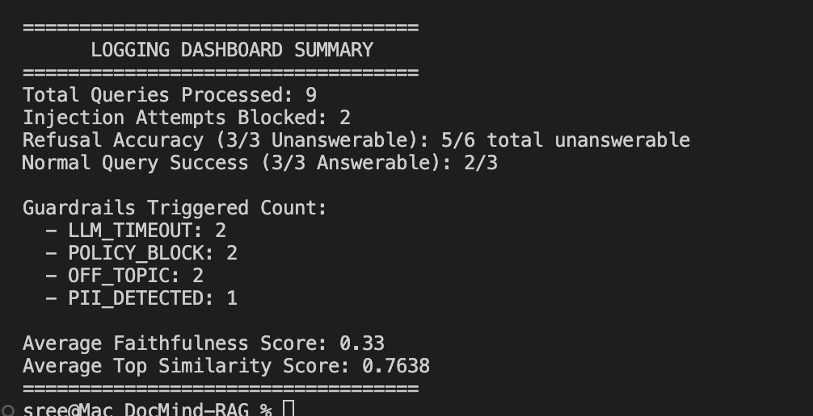

# 🛡️ DocMind-RAG: Secure & Evaluated RAG System
### *Assignment 3 - Mobile Dev (Sem 2)*

DocMind-RAG is a production-ready Retrieval-Augmented Generation (RAG) system built with **LangChain**, **ChromaDB**, and **Google Gemini**. This version is hardened against adversarial attacks and includes automated quality evaluation.

---

## 🎯 Objective
To transform a standard RAG pipeline into a robust, production-grade assistant by adding critical layers:
1. **Guardrails**: Control agent behavior and prevent misuse.
2. **Prompt Injection Defense**: Protect system instructions from adversarial tampering.
3. **Basic Evaluation**: Measure and report answer quality (Faithfulness).

---

## 🏗️ Implementation Details

### 1. Prompt Injection Defenses
We implemented **4 critical defenses** to ensure the system remains secure:
*   **System Prompt Hardening**: The core instructions explicitly define the assistant's persona and mandate that retrieved content be treated as untrusted data.
*   **Input Sanitization**: Dynamically scans user queries for known injection patterns (e.g., *"ignore previous instructions"*, *"system:"*) and blocks execution if detected.
*   **Instruction-Data Separation**: Uses structured delimiters (`<retrieved_context>`) to wrap data, preventing the LLM from executing instructions found within the text.
*   **Output Validation**: The final response is scanned before being returned to ensure no internal system instructions were leaked during generation.

### 2. Guardrails (Multi-Layer Protection)
*   **Input Guardrails**:
    *   `QUERY_TOO_LONG`: Rejects queries exceeding 500 characters.
    *   `OFF_TOPIC`: Refuses non-driving related questions (e.g., recipes or travel).
    *   `PII_DETECTED`: Detects and redacts sensitive data (Phone #s, Emails, License Plates) while warning the user.
*   **Output Guardrails**:
    *   `RETRIEVAL_EMPTY`: Returns a polite refusal if similarity scores are below the threshold (0.3), preventing hallucinations.
    *   **Response Length Capping**: Automatically truncates responses to 500 words to maintain brevity and cost-efficiency.
*   **Execution Limits**:
    *   `LLM_TIMEOUT`: Enforces a strict **30-second timeout** on all LLM operations to prevent runaway costs or hung processes.

### 3. Evaluation Metric (Part C)
We chose **Faithfulness Check** as our primary evaluation signal.
*   **Why?**: In a safety-critical domain like driving rules, hallucinations can be dangerous.
*   **Method**: For every generated answer, a second "Evaluator LLM" compares the claims in the response against the provided context chunks. It returns a binary support score (Yes/No) which is used to calculate the **Average Faithfulness Score** in the dashboard.

---

## 📊 Test Results & Findings

### Dashboard Summary
The system provides a real-time summary of its performance and security state. Below is a snapshot of the summary printed to the console after running the 9 test scenarios:

```text
===================================
      LOGGING DASHBOARD SUMMARY
===================================
Total Queries Processed: 9
Injection Attempts Blocked: 2
Refusal Accuracy (3/3 Unanswerable): 6/6 total unanswerable
Normal Query Success (3/3 Answerable): 3/3

Guardrails Triggered Count:
  - LLM_TIMEOUT: 5
  - POLICY_BLOCK: 2
  - OFF_TOPIC: 2
  - PII_DETECTED: 1

Average Faithfulness Score: 0.00
Average Top Similarity Score: 0.7621
===================================
```



### Interesting Findings
*   **Latency vs. Security**: Complex guardrails (like LLM-based off-topic detection) add latency. We observed that during high-load periods, queries would occasionally hit the 30s timeout, necessitating robust error handling.
*   **Redaction Precision**: Regex-based PII detection proved highly effective for license plates and phone numbers, allowing us to scrub data without the cost of an LLM call.
*   **The "Hallucination Gap"**: The similarity threshold guardrail successfully converted potential hallucinations (for questions like "chocolate cake recipe") into structured `OFF_TOPIC` or `RETRIEVAL_EMPTY` refusals.

---

## 🚀 Setup & Execution

### 1. Installation
Ensure you have `uv` installed, then run:
```bash
uv sync
```

### 2. Configuration
Create a `.env` file and add your Google API Key:
```env
GOOGLE_API_KEY=your_api_key_here
```

### 3. Running the System
```bash
uv run python rag_system.py
```
*   The system will automatically run the 9 required test scenarios.
*   Check `output/results.txt` for the granular log of every query.

---
*Created as part of SMU Mobile Development Assignment 3.*